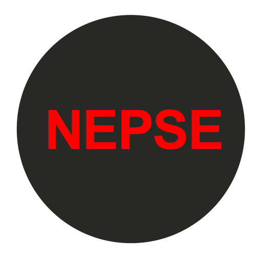

# NEPSE Extension
<div align="center">

</div>
It is a chrome extension which pulls data of NEPSE Live Stock from a json file and displays it in the form of table.

## Installation

Download and use the [jquery-3.6.0.min.js](https://code.jquery.com/jquery-3.6.0.min.js) .

## Getting Started

```python
1. Make a File Directory with the name of extension.
2. Import all the code from this repository.
3. Download the jquery-3.6.0.mini.js (Link Above).
```

## Contributing
Pull requests are welcome. For major changes, please open an issue first to discuss what you would like to change.

Please make sure to update tests as appropriate.

## Road Map

✅ Extract Data From JSON\
✅ Display in the Form of Table\
✅ Convert it Into an Browser Extension\
⬛ Add a Search Bar\
⬛ Keep Suggesting

## License
[MIT](https://choosealicense.com/licenses/mit/)